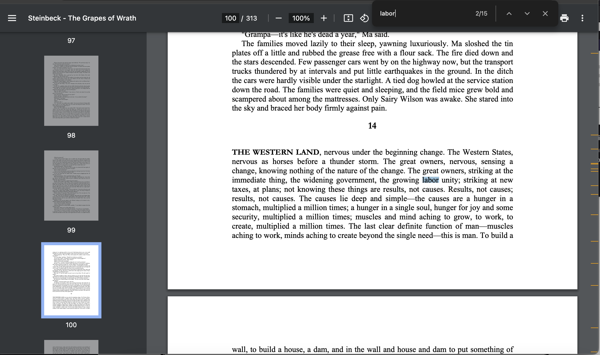

I'm using LibreOffice so closed source can't peddle my writing to some Butlerian proscribed entity.  
Sometimes when I write I forgor (when I last)||(how frequently) I use a term、 punctuation mark、 etc... and I want to avoid repetition and genericism.  
So I search for that term、 punctuation mark、 etc... and see if (the last usage is too proximate to my new intended site)||(it is generally overused).
However, LibreOffice (AFAIK, gave up after a DuckDuckGo search) doesn't display all occurrences of a search term across the span of a document, such as how chrome does along the scrollbar (example pic below)

This tool shows the occurrences of a search term per chapter

This tool crafted without:
- Enough sleep
- Sufficient principles
- Butlerian proscribed entities

TODO:
- ~~chapter labels (easy)~~ (not so easy)
- update this README
- viewmode that constricts to single chapter (hard)
- have toggles for Whole Word search and Match Case search (idk how difficult it is for allow regex search)
- have viewmode where camera moves to each search hit in sequence (probably involved), user can switch between free pan and this new mode
- maybe have a unified mode rather than broken down by chapter (this will be ugly probably)
- support odt
- rn the textinput has default behaviour where either \<ENTER\> or \<clicking away from textinput\> triggers the callback.    I would like it to only be on \<ENTER\>, as rn it will most likely cause one redundant callback invocation >:(

pondering:
have three modes: [by chapter, unified, single chapter (a subtype of unified)]
each of the two main modes by (chapter, unified) have different functions supporting them.
This is because having single functions deal with both generally is difficult :(
for ex: gather_stats.py: get_stats_by_chapter(), get_stats_unified
        plot.py:         vis_by_chapter(), vis_unified(),   // maybe these can have a single general purpose func, or at most a modest wrapper
                         spotlight_by_chapter(), spotlight_unified() // maybe these can have a single general purpose func, or at most a modest wrapper

internal deps:
       _____ aggregate_keeper \
      /                        \____
consts                          ____ spotlight ----- plot
                               /
gather_stats ------- my_types /

// my_types shouldn't depend on gather_stats... shouldn't depend on anything